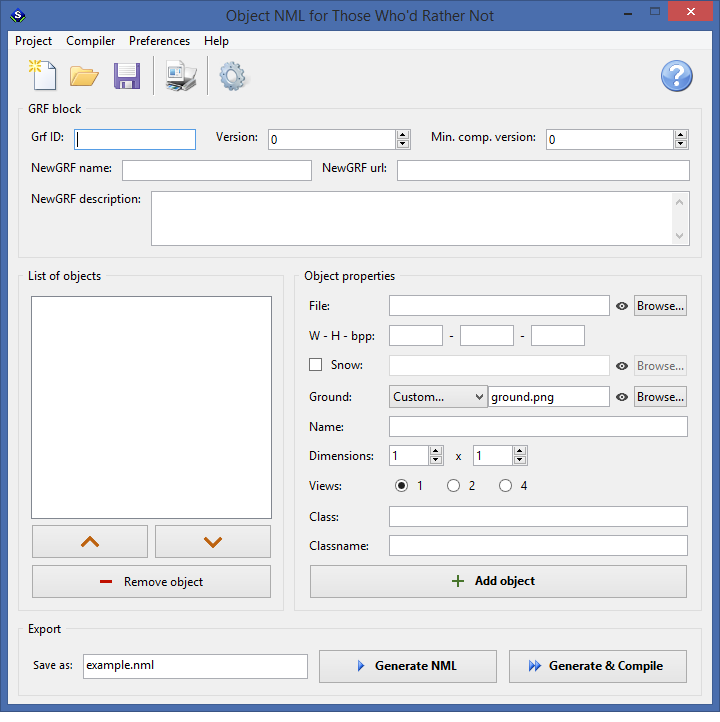

# ObjectNMLGenerator

**ObjectNMLGenerator** is a scripting tool that generates NML code for OpenTTD's **Object NewGRFs** via a graphical user interface (GUI).

It is designed for users with little or no experience in NML or coding, with the main focus on making the process comprehensible.

For deeper understanding of NML, refer to these resources:

- [TT-Wiki: NML Tutorial](https://www.tt-wiki.net/wiki/NMLTutorial) – general NML information
- [TT-Wiki: Objects](https://newgrf-specs.tt-wiki.net/wiki/NML:Objects) – object-specific details

Although the generated NML code covers basic functionality (object dimensions, number of views, options for snow sprites and ground sprites, etc.), _experienced_ users can still benefit from the **programatically generated templates**. These templates can be extended with advanced features as needed.

## Features

* **No coding required** – generate functional NML for OpenTTD objects through a practical graphical interface
* **Portable and easy** – lightweight Windows release, no installation needed
* **Sprite handling**
    - supports both 8 bpp (DOS palette) and 32 bpp (RGBA with transparency) PNG sprites
    - automatic management of snow variants and custom ground sprites
* **Object properties editor** – define dimensions, views, classes, and names with immediate in-app validation
* **Ready-to-use output** – produces `.nml` source files and language files, structured for direct compilation into `.grf`
* **YAML-based project files** - save and reload object lists for editing in human-readable YAML

## Installation

Download the latest **portable Windows release** from the [Releases](https://github.com/chujo-chujo/ObjectNMLGenerator/releases) page. 
It includes all required dependencies precompiled (Lua, IUP, IM), so no additional setup is needed.

After extracting the contents of `ObjectNMLGenerator-winx64-portable.zip`, you can **start the program** by running `START.bat`.

## Dependencies

This script uses the [IUP Portable User Interface](https://www.tecgraf.puc-rio.br/iup/) (`iuplua`) and [IM image processing library](https://www.tecgraf.puc-rio.br/im/) (`imlua`), licensed under the terms of the MIT license. 
For full copyright notice, go to [Tecgraf Library License](https://www.tecgraf.puc-rio.br/iup/en/copyright.html).

## Usage

For detailed instructions, screenshots, and examples, please refer to the full manual:

👉 [ObjectNMLGenerator Manual](https://chujo-chujo.github.io/ObjectNMLGenerator/)

## Contact

If you have questions about the app, you can reach me 
**@chujo** on OpenTTD's Discord ([discord.gg/openttd](https://discord.gg/openttd))

For general questions about NML or NewGRF development, 
feel free to ask in the **`# add-on-development`** channel.

## License

This project is licensed under [CC BY-NC-SA 4.0](https://creativecommons.org/licenses/by-nc-sa/4.0/).
See the [LICENSE](./LICENSE) file for details.
